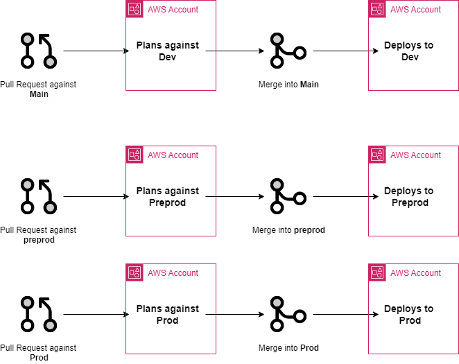
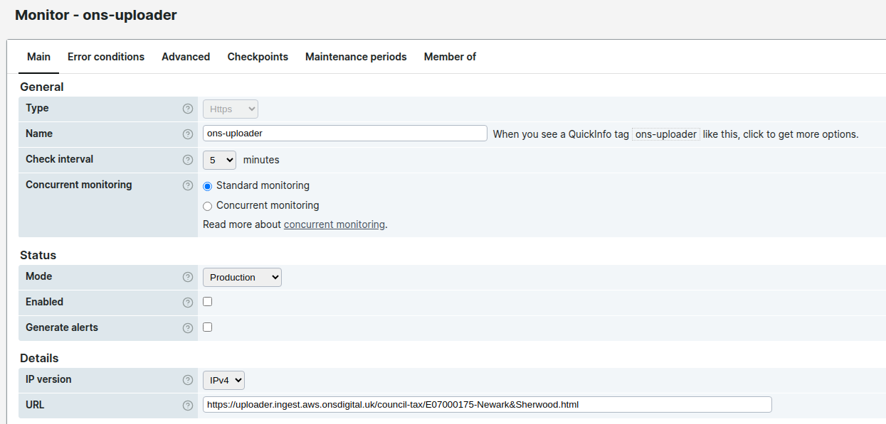
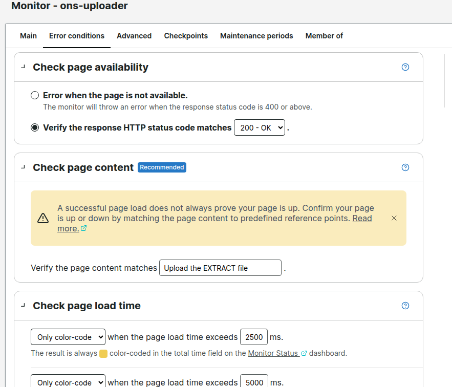

# AWS Uploader

This solution hosts the infrastructure to build a website that allows specific users to upload EXTRACT and MANI files inside a secured S3 bucket and deploy it into
dev, pre-prod and production environments.
This template is designed to help you start an AWS terraform repository in the same structure across all projects.

The solution deploys:

  ○ Host S3 Bucket: With enabled static website hosting and the appropriate permissions
  ○ CloudFront Distribution: Linked to the Host S3 Bucket
  ○ IAM Roles and Policies
  ○ HTML Scripts: All html pages that will be hosted inside the S3 Bucket
  ○ Lambda Script: Create "PreSignedURL" script that will be targeting the Ingest Bucket
  ○ Ingest S3 Bucket: Creating the ingest bucket where the files will be uploaded and set the appropriate permissions
  ○ Set up Route 53 DNS: Generates unique URL for each council

# cicd

Image needs updating but shows how the flow will work expect all pull requests against main will apply in dev.



# Pre Commits

This repository makes use of <https://github.com/gruntwork-io/pre-commit> to help enforce code quality.
Useful guide <https://medium.com/slalom-build/pre-commit-hooks-for-terraform-9356ee6db882>

## Prerequisites

You will need to install the following:

- [Pre Commit](https://github.com/gruntwork-io/pre-commit) -
`brew install pre-commit`
- [Terraform](https://learn.hashicorp.com/tutorials/terraform/install-cli) - `brew tap hashicorp/tap`,
              `brew install hashicorp/tap/terraform`
- [TFSec](https://github.com/aquasecurity/tfsec) - `brew install tfsec`
- [Terraform Docs](https://terraform-docs.io/user-guide/installation/) - `brew install terraform-docs`
- [Pre Commit Hooks](https://github.com/pre-commit/pre-commit-hooks) - `pip install pre-commit-hooks`
- [Tflint](https://github.com/terraform-linters/tflint) - `brew install tflint`

## Usage

Once you have met all the prerequisites install pre commit on the reposiotry

```
pre-commit install
```

Configuration for the pre commit can be found in .pre-commit-config.yaml

Pre commit is doing:

- terraform-validate - ensuring any terraform code which is being committed is valid
- terraform fmt - formatting any terraform which is being committed.
- terraform-docs - Used to automatically generate documentation for this repo
- Tflint - Finds invalid configuration with AWS Terraform, enforces agreed apon best practices, warns about deprecated syntax
- Tfsec - Checks for misconfigurations in terraform code against security protocols
- Git checks - checks for large files being commited, merge conflicts, end of file fixes, checks for any potential secrets being committed.

## Terraform

Only use this method for testing locally, all deployments should go through your CICD pipeline.

### Authenticate with AWS

Log into AWS and select the account required. Select Command line and programmatic access and select option 1.

```
export AWS_ACCESS_KEY_ID="YOUR_ACCESS_KEY"
export AWS_SECRET_ACCESS_KEY="YOUR_SECRET_ACCESS_KEY"
export AWS_DEFAULT_REGION="eu-west-2"
export S3_BUCKET_NAME="YOUR_BUCKET_NAME"
```

Terraform init

```
terraform init -backend-config=bucket="${S3_BUCKET_NAME}"
-backend-config=key="tfstate/default.tfstate"
-backend-config=dynamodb_table="lockstable"
-backend-config=region="eu-west-2"
```

Run terraform plan

```
terraform plan -var-file=env/env.tfvars
```

### Onboarding New Councils

This is a guide to creating new Council Tax upload pages:

Edit the councils.csv to add the new code and council name to the bottom of the list. Commit the change and the necessary pages will be added.

Be sure that the csv maintains its header row and the lad code is the right format.
Example first two lines
"name","lad_code"
"Test","E00000000"

## Running Behaviour tests
Behaviour tests should be run before raising a Pull Request.
Depending on your package manager of choice you can run

```bash
yarn install
yarn test
```

or

```bash
npm install
npm test
```

or, you can make use of the makefile and run

```bash
make behaviour-tests
```

after installing the package dependencies.

## Github Automatic reviewers

The template is setup to use codeowners, this is setup within the `.github` folder within the `CODEOWNERS` file. By default it is set to the CIA team, to update this change or add another github team.

## Dependabot

Dependabot is setup to check dependency versions within terraform, this will automatically open a PR every Monday for any providers which are out of date.

## CICD

Concourse uses YAML to create the pipelines, which is works well until you start to create bigger pipelines to support bigger environments.
Within the `ci` folder there are two examples `aviator` and `concourse`. Read the README in both sections to work out which is better for your usecase.

## Maintenance Mode

The service can be put into maintenance mode to prevent access during system maintenance. A Lambda@Edge function checks the maintenance status and redirects users to a maintenance page.

Authenticate with the AWS account user credentials

**Activate with custom message and date:**

```bash
aws ssm put-parameter --name "/uploader/maintenance-mode" --value '{"enabled":true,"message":"2 pm on Monday 16 December 2025"}' --type String --overwrite

aws cloudfront create-invalidation --distribution-id E3VWJQT6ALVUTZ --paths "/council-tax/*"
```

**Deactivate maintenance mode:**
```bash
aws ssm put-parameter --name "/uploader/maintenance-mode" --value "false" --type String --overwrite

aws cloudfront create-invalidation --distribution-id E3VWJQT6ALVUTZ --paths "/council-tax/*"
```

Changes take effect within 60 seconds due to Lambda@Edge caching.

## Monitoring

The deployed production solution is monitored by [uptrends.com](https://uptrends.com). There are two monitors in place

- Connectivity to <https://uploader.ingest.aws.onsdigital.uk/council-tax/E07000175-Newark&Sherwood.html>
- The presence of a fixed string in the page is also tested for - this is currently "Upload the EXTRACT file".
 

 CSS control the uptrends system. Chris U. also has a logon.

<!-- BEGIN_TF_DOCS -->
## Requirements

| Name | Version |
|------|---------|
| <a name="requirement_terraform"></a> [terraform](#requirement\_terraform) | >= 1.8.0 |
| <a name="requirement_terraform"></a> [terraform](#requirement\_terraform) | >= 1.8.0 |
| <a name="requirement_archive"></a> [archive](#requirement\_archive) | >= 2.7.0 |
| <a name="requirement_aws"></a> [aws](#requirement\_aws) | >= 5.94.1 |
| <a name="requirement_null"></a> [null](#requirement\_null) | >= 3.2.0 |

## Providers

| Name | Version |
|------|---------|
| <a name="provider_archive"></a> [archive](#provider\_archive) | 2.7.1 |
| <a name="provider_aws"></a> [aws](#provider\_aws) | 5.99.1 |
| <a name="provider_aws.useast"></a> [aws.useast](#provider\_aws.useast) | 5.99.1 |
| <a name="provider_null"></a> [null](#provider\_null) | 3.2.4 |
| <a name="provider_terraform"></a> [terraform](#provider\_terraform) | n/a |

## Modules

| Name | Source | Version |
|------|--------|---------|
| <a name="module_ons_upload_bucket"></a> [ons\_upload\_bucket](#module\_ons\_upload\_bucket) | git::https://github.com/ONSdigital/aws-s3-bucket.git | v7.4.0 |
| <a name="module_ons_upload_ingest_bucket"></a> [ons\_upload\_ingest\_bucket](#module\_ons\_upload\_ingest\_bucket) | git::https://github.com/ONSdigital/aws-s3-bucket.git | v7.4.0 |
| <a name="module_render_council"></a> [render\_council](#module\_render\_council) | ./modules/render_council | n/a |

## Resources

| Name | Type |
|------|------|
| [aws_acm_certificate.uploader](https://registry.terraform.io/providers/hashicorp/aws/latest/docs/resources/acm_certificate) | resource |
| [aws_acm_certificate_validation.cert](https://registry.terraform.io/providers/hashicorp/aws/latest/docs/resources/acm_certificate_validation) | resource |
| [aws_apigatewayv2_api.api](https://registry.terraform.io/providers/hashicorp/aws/latest/docs/resources/apigatewayv2_api) | resource |
| [aws_apigatewayv2_integration.get](https://registry.terraform.io/providers/hashicorp/aws/latest/docs/resources/apigatewayv2_integration) | resource |
| [aws_apigatewayv2_integration.options](https://registry.terraform.io/providers/hashicorp/aws/latest/docs/resources/apigatewayv2_integration) | resource |
| [aws_apigatewayv2_route.get](https://registry.terraform.io/providers/hashicorp/aws/latest/docs/resources/apigatewayv2_route) | resource |
| [aws_apigatewayv2_route.options](https://registry.terraform.io/providers/hashicorp/aws/latest/docs/resources/apigatewayv2_route) | resource |
| [aws_apigatewayv2_stage.api](https://registry.terraform.io/providers/hashicorp/aws/latest/docs/resources/apigatewayv2_stage) | resource |
| [aws_athena_database.access_logs](https://registry.terraform.io/providers/hashicorp/aws/latest/docs/resources/athena_database) | resource |
| [aws_athena_workgroup.access_logs](https://registry.terraform.io/providers/hashicorp/aws/latest/docs/resources/athena_workgroup) | resource |
| [aws_cloudfront_distribution.uploader](https://registry.terraform.io/providers/hashicorp/aws/latest/docs/resources/cloudfront_distribution) | resource |
| [aws_cloudfront_function.rewrite_default_index_request](https://registry.terraform.io/providers/hashicorp/aws/latest/docs/resources/cloudfront_function) | resource |
| [aws_cloudfront_origin_access_control.ons_uploader_cloudfront](https://registry.terraform.io/providers/hashicorp/aws/latest/docs/resources/cloudfront_origin_access_control) | resource |
| [aws_cloudfront_origin_access_identity.oai](https://registry.terraform.io/providers/hashicorp/aws/latest/docs/resources/cloudfront_origin_access_identity) | resource |
| [aws_cloudfront_response_headers_policy.custom_security_headers](https://registry.terraform.io/providers/hashicorp/aws/latest/docs/resources/cloudfront_response_headers_policy) | resource |
| [aws_cloudwatch_log_group.api_gateway_log_group](https://registry.terraform.io/providers/hashicorp/aws/latest/docs/resources/cloudwatch_log_group) | resource |
| [aws_cloudwatch_log_group.cloudfront_log_group](https://registry.terraform.io/providers/hashicorp/aws/latest/docs/resources/cloudwatch_log_group) | resource |
| [aws_cloudwatch_log_group.lambda_log_group](https://registry.terraform.io/providers/hashicorp/aws/latest/docs/resources/cloudwatch_log_group) | resource |
| [aws_iam_policy.PreSignedURL_s3_policy](https://registry.terraform.io/providers/hashicorp/aws/latest/docs/resources/iam_policy) | resource |
| [aws_iam_role.PreSignedURL_role](https://registry.terraform.io/providers/hashicorp/aws/latest/docs/resources/iam_role) | resource |
| [aws_iam_role.cloudwatch_global](https://registry.terraform.io/providers/hashicorp/aws/latest/docs/resources/iam_role) | resource |
| [aws_iam_role_policy_attachment.PreSignedURL_s3_policy](https://registry.terraform.io/providers/hashicorp/aws/latest/docs/resources/iam_role_policy_attachment) | resource |
| [aws_iam_role_policy_attachment.lambda_basic](https://registry.terraform.io/providers/hashicorp/aws/latest/docs/resources/iam_role_policy_attachment) | resource |
| [aws_lambda_function.PreSignedURL](https://registry.terraform.io/providers/hashicorp/aws/latest/docs/resources/lambda_function) | resource |
| [aws_lambda_permission.presignedurl_permission](https://registry.terraform.io/providers/hashicorp/aws/latest/docs/resources/lambda_permission) | resource |
| [aws_route53_record.cert_validation](https://registry.terraform.io/providers/hashicorp/aws/latest/docs/resources/route53_record) | resource |
| [aws_route53_record.uploader](https://registry.terraform.io/providers/hashicorp/aws/latest/docs/resources/route53_record) | resource |
| [aws_s3_bucket.cloudfront_logging_bucket](https://registry.terraform.io/providers/hashicorp/aws/latest/docs/resources/s3_bucket) | resource |
| [aws_s3_bucket_acl.cloudfront](https://registry.terraform.io/providers/hashicorp/aws/latest/docs/resources/s3_bucket_acl) | resource |
| [aws_s3_bucket_cors_configuration.uploader](https://registry.terraform.io/providers/hashicorp/aws/latest/docs/resources/s3_bucket_cors_configuration) | resource |
| [aws_s3_bucket_lifecycle_configuration.ingest_lifecycle_policy](https://registry.terraform.io/providers/hashicorp/aws/latest/docs/resources/s3_bucket_lifecycle_configuration) | resource |
| [aws_s3_bucket_ownership_controls.cloudfront_logging_bucket](https://registry.terraform.io/providers/hashicorp/aws/latest/docs/resources/s3_bucket_ownership_controls) | resource |
| [aws_s3_bucket_policy.uploader_bucket](https://registry.terraform.io/providers/hashicorp/aws/latest/docs/resources/s3_bucket_policy) | resource |
| [aws_s3_bucket_policy.uploader_ingest_bucket](https://registry.terraform.io/providers/hashicorp/aws/latest/docs/resources/s3_bucket_policy) | resource |
| [aws_s3_bucket_public_access_block.cloudfront_logging_bucket](https://registry.terraform.io/providers/hashicorp/aws/latest/docs/resources/s3_bucket_public_access_block) | resource |
| [aws_s3_bucket_server_side_encryption_configuration.cloudfront_logging_bucket](https://registry.terraform.io/providers/hashicorp/aws/latest/docs/resources/s3_bucket_server_side_encryption_configuration) | resource |
| [aws_s3_bucket_website_configuration.ons_upload_configuration](https://registry.terraform.io/providers/hashicorp/aws/latest/docs/resources/s3_bucket_website_configuration) | resource |
| [aws_s3_object.council_home_page](https://registry.terraform.io/providers/hashicorp/aws/latest/docs/resources/s3_object) | resource |
| [aws_s3_object.file_submission](https://registry.terraform.io/providers/hashicorp/aws/latest/docs/resources/s3_object) | resource |
| [aws_s3_object.home_page](https://registry.terraform.io/providers/hashicorp/aws/latest/docs/resources/s3_object) | resource |
| [aws_s3_object.result_message](https://registry.terraform.io/providers/hashicorp/aws/latest/docs/resources/s3_object) | resource |
| [aws_s3_object.success_page](https://registry.terraform.io/providers/hashicorp/aws/latest/docs/resources/s3_object) | resource |
| [aws_wafv2_web_acl.uploader_waf_cloudfront](https://registry.terraform.io/providers/hashicorp/aws/latest/docs/resources/wafv2_web_acl) | resource |
| [null_resource.execute_query](https://registry.terraform.io/providers/hashicorp/null/latest/docs/resources/resource) | resource |
| [terraform_data.invalidate_cf_caches](https://registry.terraform.io/providers/hashicorp/terraform/latest/docs/resources/data) | resource |
| [archive_file.PreSignedURL](https://registry.terraform.io/providers/hashicorp/archive/latest/docs/data-sources/file) | data source |
| [aws_caller_identity.current](https://registry.terraform.io/providers/hashicorp/aws/latest/docs/data-sources/caller_identity) | data source |
| [aws_canonical_user_id.current](https://registry.terraform.io/providers/hashicorp/aws/latest/docs/data-sources/canonical_user_id) | data source |
| [aws_cloudfront_log_delivery_canonical_user_id.cloudfront](https://registry.terraform.io/providers/hashicorp/aws/latest/docs/data-sources/cloudfront_log_delivery_canonical_user_id) | data source |
| [aws_iam_policy_document.get_s3_object](https://registry.terraform.io/providers/hashicorp/aws/latest/docs/data-sources/iam_policy_document) | data source |
| [aws_iam_policy_document.lambda_role](https://registry.terraform.io/providers/hashicorp/aws/latest/docs/data-sources/iam_policy_document) | data source |
| [aws_iam_policy_document.uploader_bucket](https://registry.terraform.io/providers/hashicorp/aws/latest/docs/data-sources/iam_policy_document) | data source |
| [aws_iam_policy_document.uploader_ingest_bucket](https://registry.terraform.io/providers/hashicorp/aws/latest/docs/data-sources/iam_policy_document) | data source |
| [aws_region.current](https://registry.terraform.io/providers/hashicorp/aws/latest/docs/data-sources/region) | data source |
| [aws_route53_zone.domain](https://registry.terraform.io/providers/hashicorp/aws/latest/docs/data-sources/route53_zone) | data source |
| [aws_sqs_queue.nifi_sqs](https://registry.terraform.io/providers/hashicorp/aws/latest/docs/data-sources/sqs_queue) | data source |

## Inputs

| Name | Description | Type | Default | Required |
|------|-------------|------|---------|:--------:|
| <a name="input_api_gateway_cloudwatch"></a> [api\_gateway\_cloudwatch](#input\_api\_gateway\_cloudwatch) | name\_for\_api\_gateway\_cloudwatch\_group | `string` | `"api_gateway_cloudwatch"` | no |
| <a name="input_cloudfront_logging_bucket"></a> [cloudfront\_logging\_bucket](#input\_cloudfront\_logging\_bucket) | Bucket for logging cloudfront distribution | `string` | n/a | yes |
| <a name="input_cloudwatch_retention_days"></a> [cloudwatch\_retention\_days](#input\_cloudwatch\_retention\_days) | number of days to retain cloudwatch logs | `string` | `365` | no |
| <a name="input_domain_name"></a> [domain\_name](#input\_domain\_name) | Domain name for the DNS within an account to use. | `string` | n/a | yes |
| <a name="input_lambda_PreSignedURL_function"></a> [lambda\_PreSignedURL\_function](#input\_lambda\_PreSignedURL\_function) | lambda name for the PreSignedURL function | `string` | `"PreSignedURL"` | no |
| <a name="input_region"></a> [region](#input\_region) | Region in which to create resources | `string` | `"eu-west-2"` | no |
| <a name="input_sqs_notification_id"></a> [sqs\_notification\_id](#input\_sqs\_notification\_id) | sqs\_notification\_id | `string` | n/a | yes |
| <a name="input_target_account_id"></a> [target\_account\_id](#input\_target\_account\_id) | Target account ID you wish to deploy to | `string` | n/a | yes |
| <a name="input_upload_host_bucket_name"></a> [upload\_host\_bucket\_name](#input\_upload\_host\_bucket\_name) | Hosting the html for ONS Uploader webapp | `string` | n/a | yes |
| <a name="input_upload_ingest_bucket_name"></a> [upload\_ingest\_bucket\_name](#input\_upload\_ingest\_bucket\_name) | Bucket for ingesting files | `string` | n/a | yes |

## Outputs

| Name | Description |
|------|-------------|
| <a name="output_website_domain"></a> [website\_domain](#output\_website\_domain) | domain name for the cloudfront website |
<!-- END_TF_DOCS -->
